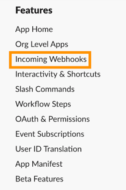
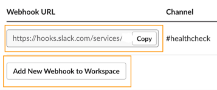

# Health Check for Slack Webhooks

## 1. How to start?
1. Clone repo where ever you can run script frequently
2. Create venv install requirements.txt
3. Get your [slack webhook url](#2-get-slack-webhook-url)
4. Prepare your [configuration.json](#3-create-your-configurationjson-file)
5. Run `main.py --test` (You should get hello message on slack)
6. Prepare script runner (I use [cron](#4-cron))
7. I hope you enjoy!

You can also see logs [section](#5-logs).

## 2. Get slack webhook url

1. Go to https://api.slack.com/messaging/webhooks
2. Click `Create your Slack app`
3. Click `Create new app` and follow the steps
4. In left panel slack app go to `Incoming webhooks`

5. Turn On `Activate Incoming Webhooks`
6. `Add New Webhook to Workspace`
7. After choose channel you can copy your url


## 3. Create your configuration.json file

`slack_webhook_url` is required in configuration.json. Put here your url
```
 "slack_webhook_url": "https://hooks.slack.com/services/AAAAAA/BBBBBBBB/CCCCCCCCCC",
```

`health_check_config` it's optional key, also timeout is optional (default is 3 sec)

This param tells how long each request will take before it reaches timeout.
```
"health_check_config": { 
    "timeout": 3 # in sec
},
```

This section and all params of this is optional. Defaults are equal below example.
```
  "slack_connector_config": {
    "send_healthy": false, # send `healthy_message` on slack, for each "healthy" request
    "send_unhealthy": true, # send `unhealthy_message` on slack, for each "unhealthy" request
    "send_still_unhealthy": true, # send reminder `still_unhealthy_message` if url still "unhealthy"
    "send_still_unhealthy_delay": 10, # how ofeten send `still_unhealthy_message` in min
    "send_back_to_healthy": true, # send `back_to_healthy_message` when url back to "healthy"
    "send_if_there_no_unhealthy": false, # send `send_if_there_no_unhealthy` after each run where no "unhealthy" urls
    "hello_message": ":wave: Hi, we are connected! Let's go! :tada:", # send for run `main.py` with `--test` flag
    "healthy_message": "URL {url} is fine :heart:",
    "unhealthy_message": "URL {url} is dead :firecracker::skull_and_crossbones::firecracker:",
    "no_unhealthy_message": "Everything is fine :green_heart:",
    "back_to_healthy_message": "URL {url}, back to live! :tada: Total dead time {how_long_was_unhealthy} min",
    "still_unhealthy_message": "URL {url}, is still dead :firecracker::skull_and_crossbones::firecracker: Total dead time {how_long_was_unhealthy} min"
  },

```

Available tags for each message (tags doesn't work only for `no_unhealthy_message`)
```
{url} # requested url
{param} # requested param (look to `to_checks` section)
{status_code} # status_code after request
{is_healthy} # true/fals
{how_long_was_unhealthy} # in min, if url was healthy this tag return 0
```

Main section, `to_checks` required list of json (it can be one json of course).

`url_base`- full URL you want checking. Tag `{param}` isn't required if you want check only one url.
If you want check many url with the same base you can put tag `{param}`. 

Each combo of `url_base` and his params will be requested.
You can put many `url_base` each with diff params.
```
"to_checks": [
    {
      "url_base": "https://{param}.my_backend.com/",
      "params": [
        "backend_1",
        "backend_2",
        "back_end"
      ]
    },
    {
      "url_base": "https://my_app_fronted.com/rest_of_url/{param}",
      "params": [
        "front_1",
        "front_2"
      ]
    }
  ]
```

### Your final `configuration.json` should look like this:
```
{
  "slack_webhook_url": "https://hooks.slack.com/services/AAAAAA/BBBBBBBB/CCCCCCCCCC",
  "health_check_config": { 
    "timeout": 3
  },
  "slack_connector_config": {
    "send_healthy": false,
    "send_unhealthy": true,
    "send_still_unhealthy": true,
    "send_still_unhealthy_delay": 10,
    "send_back_to_healthy": true,
    "send_if_there_no_unhealthy": false,
    "hello_message": ":wave: Hi, we are connected! Let's go! :tada:",
    "healthy_message": "URL {url} is fine :heart:",
    "unhealthy_message": "URL {url} is dead :firecracker::skull_and_crossbones::firecracker:",
    "no_unhealthy_message": "Everything is fine :green_heart:",
    "back_to_healthy_message": "URL {url}, back to live! :tada: Total dead time {how_long_was_unhealthy} min",
    "still_unhealthy_message": "URL {url}, is still dead :firecracker::skull_and_crossbones::firecracker: Total dead time {how_long_was_unhealthy} min"
  },
  "to_checks": [
    {
      "url_base": "https://{param}.my_backend.com/",
      "params": [
        "backend_1",
        "backend_2",
        "back_end"
      ]
    },
    {
      "url_base": "https://my_app_fronted.com/rest_of_url/{param}",
      "params": [
        "front_1",
        "front_2"
      ]
    }
  ]
}

```

## 4. Cron
To run scrip every 1 min I use cron on external server with ubuntu
```
crontab -e
```

Replace `/health-check/source/bin/python` by your venv location.
Replace `/health-check/health-check-slack/main.py` by your location of `main.py`
```
*/1 * * * * /health-check/source/bin/python /health-check/health-check-slack/main.py
```

## 5. Logs
Health Checker create file named `logs`
Each request to url you checking create below log:
```
f"{datetime.now()} - url: {health_result.url} - param: {health_result.param} - status_code: {health_result.status_code} - is_healthy: {health_result.is_healthy}"
```

Each send message to slack create below log:
```
f"{datetime.now()} - send to slack: success - text: {text}"
```

Logs older than 30 days are automatically deleted. 
